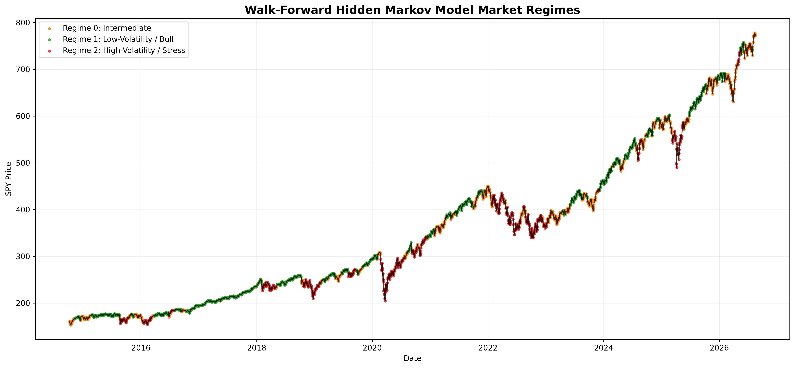
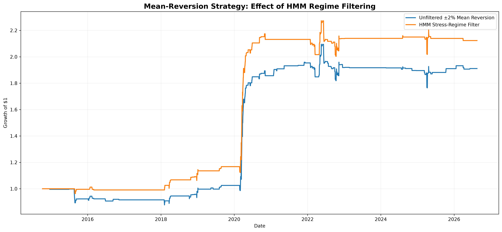
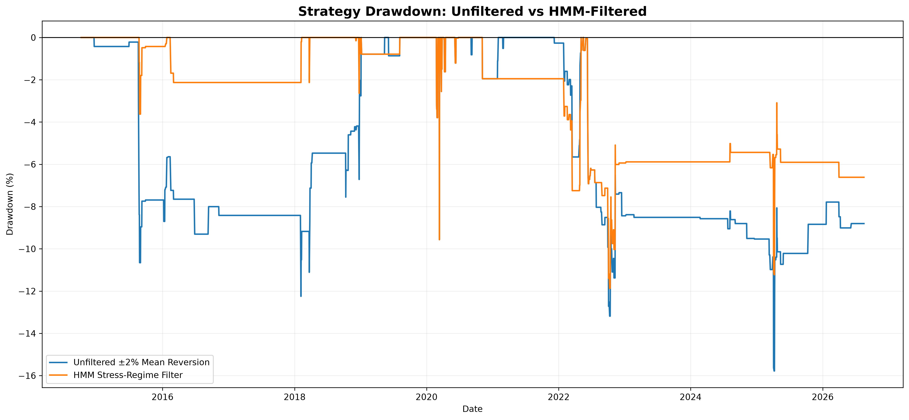
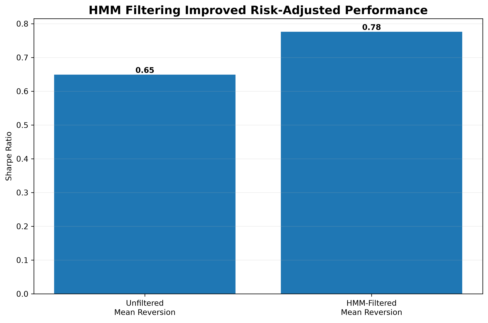
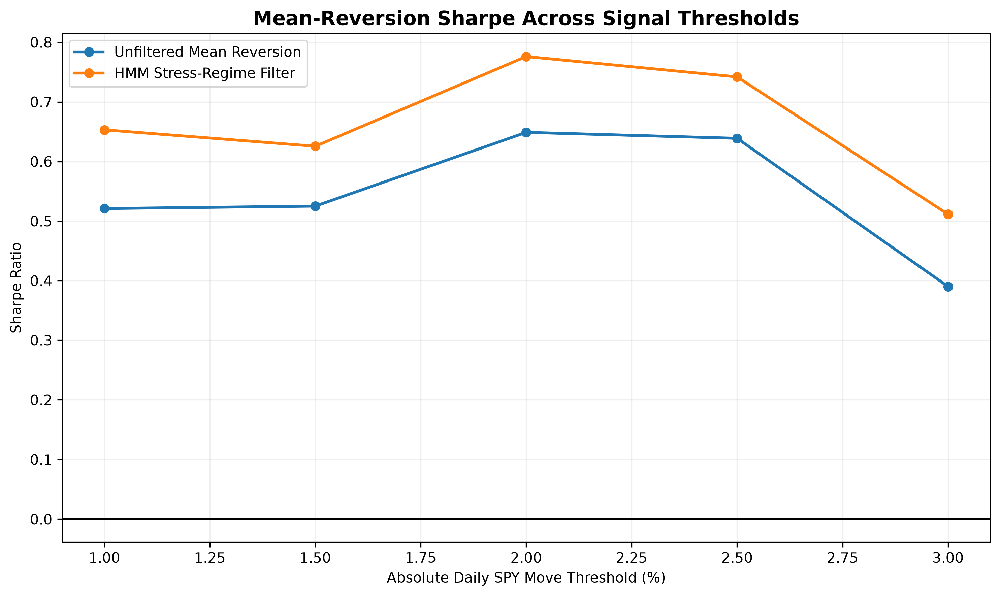
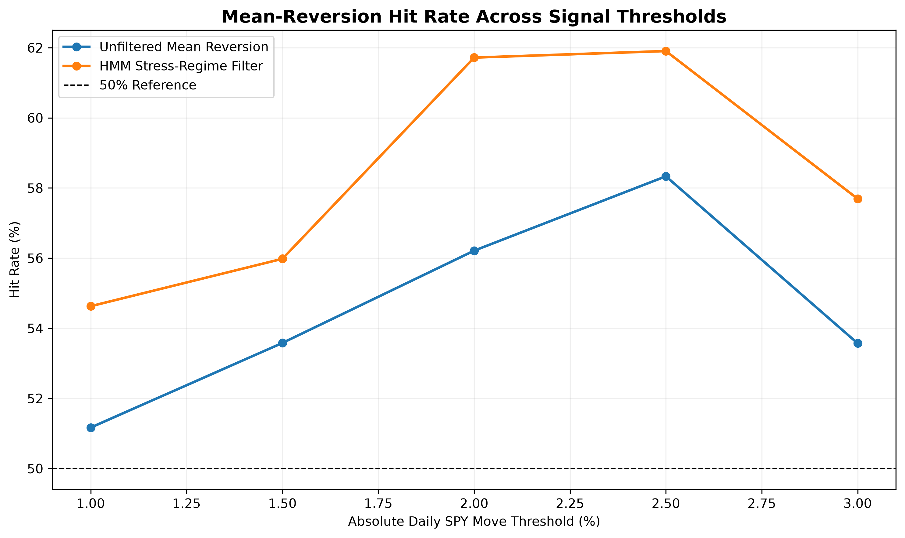

# Regime-Aware Trading with Hidden Markov Models

A quantitative research project investigating whether **market regime detection can improve short-horizon trading signals**.

The project uses a **Hidden Markov Model (HMM)** to identify latent market regimes in SPY from price, volatility, and momentum data. Regimes are estimated using a **walk-forward framework** so that each historical prediction uses only information available at that point in time.

The main finding is that conditioning a simple mean-reversion strategy on HMM-detected high-volatility regimes improved out-of-sample risk-adjusted performance across multiple signal thresholds.

---

## Key Results

Using out-of-sample SPY data from **October 2014 through August 2026**:

| Metric | Unfiltered Mean Reversion | HMM-Filtered Mean Reversion |
|---|---:|---:|
| Sharpe Ratio | 0.65 | **0.78** |
| Hit Rate | 56.21% | **61.72%** |
| Maximum Drawdown | -15.78% | **-11.87%** |
| CAGR | 5.63% | **6.57%** |
| Active Trading Days | 169 | **128** |

The HMM filter:

- Increased Sharpe from **0.65 to 0.78**
- Increased hit rate by **5.51 percentage points**
- Reduced maximum drawdown from **15.78% to 11.87%**
- Removed approximately **24% of potential trades**
- Increased average active-day return from **0.41% to 0.62%**

The results suggest that market-regime information can help distinguish higher-quality mean-reversion opportunities from weaker signals.

---

## Research Question

A trading signal may not work equally well under every market condition.

For example:

- Momentum may perform differently during calm bull markets than during periods of market stress.
- Large daily price movements may mean-revert more strongly when volatility is elevated.
- A strategy that appears profitable across an entire dataset may actually derive most of its performance from a specific market environment.

This project therefore asks:

> **Can a Hidden Markov Model identify market environments in which momentum or mean-reversion signals become more effective?**

---

## Data

The analysis uses historical **SPDR S&P 500 ETF Trust (SPY)** market data.

The feature dataset contains approximately 4,000 daily observations beginning in 2010.

The first 1,000 observations are used as the initial HMM training window.

This leaves:

- **2,981 out-of-sample observations**
- First out-of-sample date: **2014-10-08**
- Last out-of-sample date: **2026-08-17**

---

## Feature Engineering

The HMM uses three market features:

### Daily Return

Measures the daily percentage change in SPY.

### 20-Day Volatility

Measures recent realized market volatility using a rolling window of daily returns.

### 20-Day Momentum

Measures SPY's recent directional price movement.

Together, these variables allow the model to distinguish between markets characterized by different combinations of:

- trend
- volatility
- recent performance

---

## Hidden Markov Model

A Hidden Markov Model assumes that the market moves through a set of **unobservable states**.

The states themselves cannot be directly observed.

Instead, the model infers them from observable market variables.

This project estimates three latent regimes:

| Regime | Interpretation |
|---|---|
| Regime 0 | Intermediate |
| Regime 1 | Low-Volatility / Bull |
| Regime 2 | High-Volatility / Stress |

The regime labels are assigned based on the statistical characteristics of each estimated state rather than assuming beforehand what each state represents.

---

## Walk-Forward Validation

A major risk in financial machine learning is **look-ahead bias**.

If a model uses future observations while estimating historical regimes, the resulting backtest can substantially overstate real-world performance.

To address this, the HMM is evaluated using walk-forward estimation.

### Procedure

1. Train the HMM on the first **1,000 trading days**.
2. Infer the current market regime using only information available up to that date.
3. Generate out-of-sample regime predictions.
4. Retrain the HMM every **21 trading days**.
5. Continue through the remaining historical sample.

The model was retrained approximately **142 times**.

No future observations are used to estimate past regimes.

---

## Walk-Forward Market Regimes



The model identifies persistent periods of low volatility, intermediate conditions, and market stress.

As a sanity check, the high-volatility regime becomes substantially more common during several known stress periods, including:

- 2015–2016 market weakness
- Q4 2018 selloff
- 2020 COVID crash
- 2022 bear market

For example, approximately **92% of trading days during the COVID crash test window** were classified as high-volatility/stress.

---

## Trading Signals

Two simple strategies were initially evaluated.

### Momentum

The momentum strategy attempts to continue recent market direction.

Conceptually:

```text
Positive recent momentum
        ↓
      LONG

Negative recent momentum
        ↓
      SHORT
```

### Mean Reversion

The mean-reversion strategy trades against unusually large daily SPY movements.

For the primary specification:

```text
SPY falls more than 2%
        ↓
Go LONG the following day
```

and:

```text
SPY rises more than 2%
        ↓
Go SHORT the following day
```

Importantly, information observed on day `t` creates a position for day `t+1`.

This prevents the strategy from trading using information that was not yet available.

---

## An Important Negative Result

Initial in-sample analysis suggested that momentum performed particularly well during the low-volatility bull regime.

However, after implementing walk-forward regime detection, much of this apparent advantage disappeared.

The low-volatility momentum Sharpe ratio fell substantially in the more realistic out-of-sample test.

Rather than removing this result, it is retained because it demonstrates an important principle in quantitative research:

> **A strategy that looks strong in-sample may not survive realistic out-of-sample validation.**

The more persistent finding was mean reversion during high-volatility market environments.

---

## Does the HMM Actually Add Value?

Finding that mean reversion works during the HMM stress regime does not automatically prove that the HMM is useful.

Mean reversion might simply work after large SPY moves regardless of market regime.

To test this, two otherwise identical strategies were compared.

### Strategy A — Unfiltered

Trade every ±2% SPY reversal signal.

### Strategy B — HMM Filtered

Trade the exact same signal only when the HMM identifies a high-volatility/stress regime.

The signal definition is therefore identical.

The only difference is the regime filter.

---

## Equity Curve



The regime-filtered strategy generated higher cumulative performance despite taking fewer trades.

The HMM filter reduced active trading days from:

**169 → 128**

while improving both return and risk-adjusted performance.

---

## Drawdown



Maximum drawdown improved from:

**-15.78% → -11.87%**

suggesting that the regime filter removed some lower-quality reversal signals.

---

## Risk-Adjusted Performance



Sharpe ratio improved from:

**0.65 → 0.78**

This represents approximately a **20% relative improvement in Sharpe ratio**.

Hit rate simultaneously increased from:

**56.21% → 61.72%**

---

## Robustness Testing

A common problem in quantitative strategy research is selecting a parameter because it happens to produce the best historical result.

To test whether the HMM result depended specifically on the ±2% threshold, the entire experiment was repeated across five different definitions of an extreme daily SPY move:

- ±1.0%
- ±1.5%
- ±2.0%
- ±2.5%
- ±3.0%

No single threshold was selected based on the robustness results.

### Results

| Threshold | Unfiltered Sharpe | HMM Sharpe | Unfiltered Hit Rate | HMM Hit Rate |
|---:|---:|---:|---:|---:|
| 1.0% | 0.52 | **0.65** | 51.17% | **54.63%** |
| 1.5% | 0.53 | **0.63** | 53.58% | **55.98%** |
| 2.0% | 0.65 | **0.78** | 56.21% | **61.72%** |
| 2.5% | 0.64 | **0.74** | 58.33% | **61.90%** |
| 3.0% | 0.39 | **0.51** | 53.57% | **57.69%** |

Across all five thresholds:

- HMM-filtered Sharpe was higher: **5/5**
- HMM-filtered hit rate was higher: **5/5**
- HMM-filtered maximum drawdown was better: **5/5**

Average improvement:

- Sharpe: **+0.12**
- Hit rate: **+3.81 percentage points**

---

## Sharpe Robustness



The HMM-filtered strategy maintains higher risk-adjusted performance across all tested reversal thresholds.

This reduces the likelihood that the primary result is simply an artifact of selecting the ±2% threshold.

---

## Hit-Rate Robustness



The HMM-filtered signal also maintains a higher hit rate across all five threshold specifications.

---

## Research Pipeline

```text
Historical SPY Data
        ↓
Feature Engineering
        ↓
Daily Returns
20-Day Volatility
20-Day Momentum
        ↓
Hidden Markov Model
        ↓
Latent Market Regimes
        ↓
Walk-Forward Retraining
        ↓
Out-of-Sample Regime Predictions
        ↓
Momentum / Mean-Reversion Signals
        ↓
HMM Regime Filtering
        ↓
Backtesting
        ↓
Baseline Comparison
        ↓
Robustness Testing
        ↓
Sharpe / Hit Rate / Drawdown Analysis
```

---

## Repository Structure

```text
regime-aware-trading/
│
├── explora_data.py
├── fit_hmm.py
├── compare_strategy.py
├── walk_forward_hmm.py
├── walk_forward_backtest.py
├── regime_filter_test.py
├── robustness_test.py
├── final_visualizations.py
│
├── figures/
│   ├── walk_forward_hmm_regimes.png
│   ├── hmm_filter_equity_curve.png
│   ├── hmm_filter_drawdown.png
│   ├── hmm_filter_sharpe.png
│   ├── threshold_sharpe_robustness.png
│   └── threshold_hit_rate_robustness.png
│
└── README.md
```

### Main Scripts

**`explora_data.py`**

Downloads/processes SPY data and constructs the initial feature dataset.

**`fit_hmm.py`**

Performs the initial Hidden Markov Model regime analysis.

**`compare_strategy.py`**

Explores momentum and mean-reversion behavior across estimated regimes.

**`walk_forward_hmm.py`**

Implements the primary walk-forward HMM framework and generates out-of-sample regime predictions.

**`walk_forward_backtest.py`**

Evaluates momentum and mean-reversion signals using walk-forward regime estimates.

**`regime_filter_test.py`**

Compares unfiltered mean reversion against HMM stress-regime-filtered mean reversion.

**`robustness_test.py`**

Repeats the regime-filter experiment across multiple signal thresholds.

**`final_visualizations.py`**

Generates the final research figures.

---

## Methodological Safeguards

Several design choices were used to make the analysis more realistic.

### No Future Regime Information

Walk-forward HMM estimation prevents future observations from determining historical regimes.

### Signal Delay

Information observed on day `t` generates a position for day `t+1`.

### Out-of-Sample Evaluation

The first 1,000 observations are used for initial model estimation, while subsequent observations form the walk-forward evaluation period.

### Baseline Comparison

The HMM-filtered strategy is compared directly against the same trading rule without regime filtering.

### Parameter Robustness

The strategy is evaluated across several signal thresholds rather than relying exclusively on one parameter choice.

---

## Limitations

This project is a research backtest and should not be interpreted as evidence of a deployable trading strategy.

Important limitations include:

### Transaction Costs

The primary results do not incorporate realistic bid-ask spreads, commissions, slippage, or market impact.

Because the strategy trades relatively infrequently, these costs may be smaller than for high-frequency strategies, but they remain relevant.

### Short Exposure

The mean-reversion rule can generate short SPY positions following large positive daily moves. Real implementation would involve financing, borrowing, or alternative instruments.

### Model Specification

The HMM assumes three latent states and uses a specific feature set. Different model structures may produce different regime classifications.

### Limited Number of Extreme Events

Large daily SPY moves are uncommon. Higher signal thresholds therefore contain relatively small numbers of observations.

For example, the ±3% robustness test contains substantially fewer trades than the ±1% test.

### Historical Dependence

Even with walk-forward testing, all conclusions are based on one historical market sample. Future market structure may differ.

### Statistical Significance

Higher Sharpe ratios and hit rates do not by themselves establish that the observed effect represents a persistent market inefficiency.

---

## Key Takeaway

The project began with a broad hypothesis that momentum and mean reversion might behave differently across market regimes.

Walk-forward testing weakened the initial momentum finding but produced a more persistent result:

> **Short-horizon mean reversion following large SPY moves performed better when restricted to HMM-detected high-volatility market regimes.**

Across five reversal thresholds, the HMM filter consistently:

- increased Sharpe ratio,
- increased hit rate,
- reduced maximum drawdown,
- and reduced the number of trades.

The result illustrates how machine-learning models can potentially be used not necessarily to predict returns directly, but to identify **market environments in which simpler trading signals behave differently**.

---

## Disclaimer

This project is for educational and research purposes only and does not constitute investment advice.